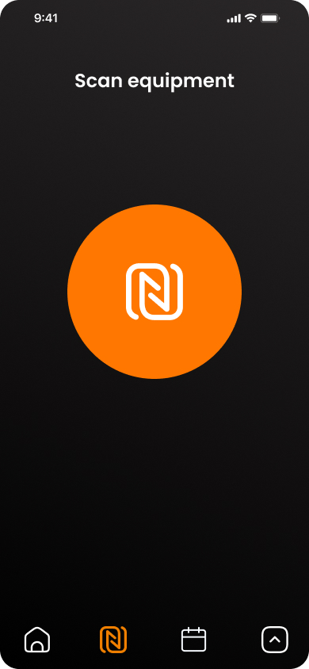
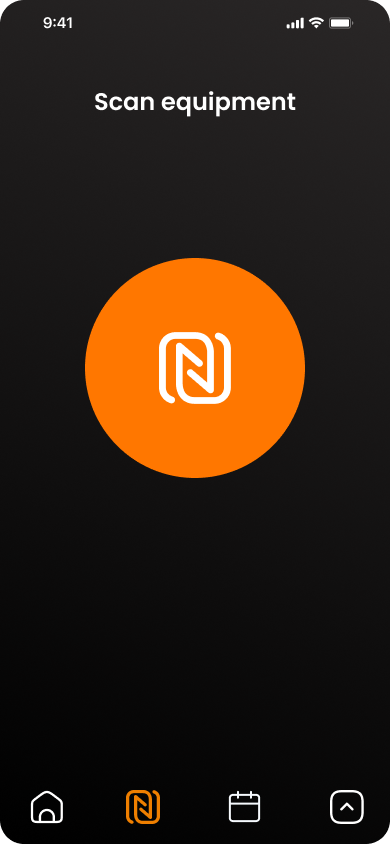
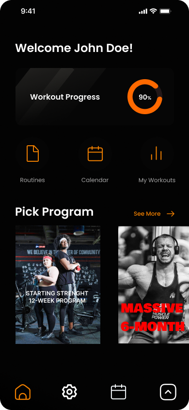

# NFC Toolkit App

This project is an NFC toolkit application designed for reading and writing data to NFC tags. Use it to interact with NFC-enabled devices for a variety of use cases, such as scanning, storing, and updating information on NFC tags.

- **Read NFC tags:** Instantly scan and display data stored on NFC tags.
- **Write to NFC tags:** Easily write custom data to compatible NFC tags.

Built with React Native and Expo for cross-platform support.

## Design mockups

Design mockups made in Figma.

  
  &nbsp;
  
  &nbsp;
  

